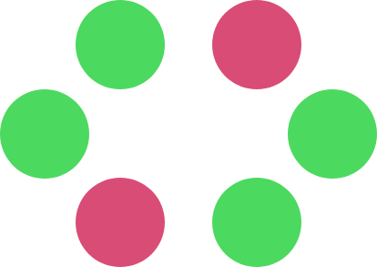
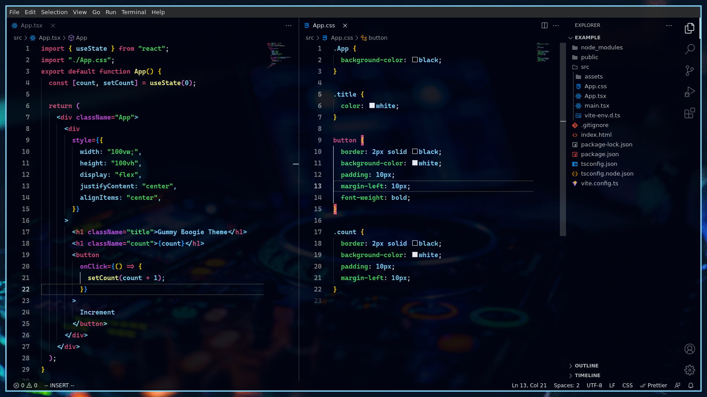
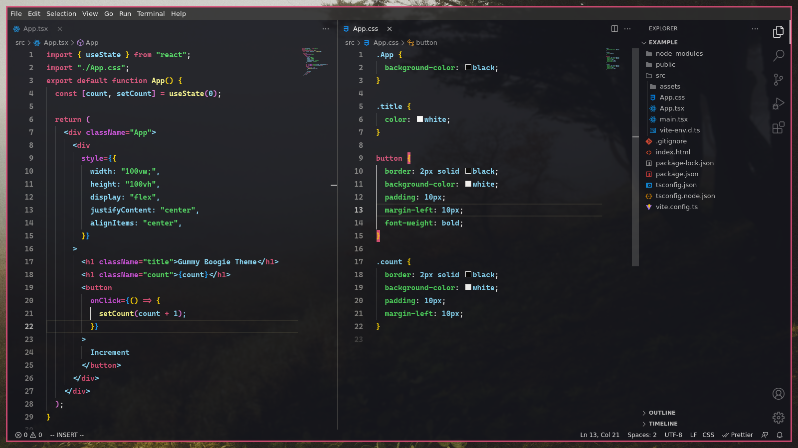
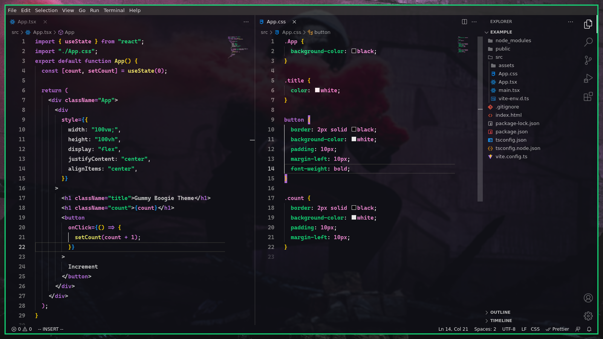

  
  <h1>Gummy Boogie Theme</h1>
  
A collection of themes composed with a gummy explosion of color for programming time.

---

    <h2>Collection</h2>
</di>

<h3 align="right"><b>Party</b> 🎉</h3>

Blue, and.. turn up the music!

| #ededed | #ffffff | #00020d | #313340 | #d94c76 | #c94cd9 | #4CD95F | #89DDFF | #fffd8e |
| ------- | ------- | ------- | ------- | ------- | ------- | ------- | ------- | ------- |

<h3 align="right"><b>Relax ☕</b> </h3>

Don't lose your mind.

| #ededed | #ffffff | #13141b | #313340 | #d94c76 | #c94cd9 | #4CD95F | #89DDFF | #fffd8e |
| ------- | ------- | ------- | ------- | ------- | ------- | ------- | ------- | ------- |

<h3 align="right"><b>NotRed! 🟣</b> </h3>

Why not purple?

| #ffffff | #0e0f15 | #313340 | #bb70e3 | #dbdbdb | #fb8fdd | #13e47c | #f4f268 | #11eb7e |
| ------- | ------- | ------- | ------- | ------- | ------- | ------- | ------- | ------- |

<h5 align="right"><b>
Note: To get the exact result of the images it is necessary to complement with other resources.</b></h5>

---

<h3 align="center">If you like it, please consider give it a star ⭐</h3>

<h4 align="center">
  <a href="URL del enlace">https://github.com/ErickDevv/Gummy-Boogie-Theme</a>
</h4>

---

  <h2>License</h2>
  
MIT License

---
