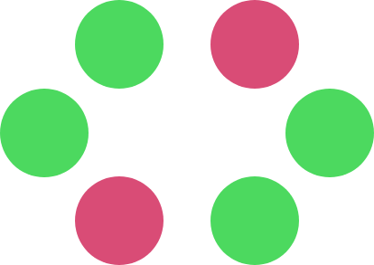

<div align="center">
  
  <h1>Gummy Boogie Theme</h1>
  <p>A collection of themes composed with a gummy explosion of color for programming time.</p>
  <a href="https://erickdevv.github.io/GummyBoogie/">https://erickdevv.github.io/GummyBoogie/</a>
</div>

---

<div align="center">

</div>

## Integrations

### Visual Studio Code

**Install from VSIX (manual)**

```bash
git clone https://github.com/ErickDevv/Gummy-Boogie-Theme.git
cd Gummy-Boogie-Theme/vscode
npm install
npx vsce package
code --install-extension gummy-boogie-theme-*.vsix
```

---

### Warp Terminal

1. Download [`Gummy-Boogie-Theme.yml`](./warp/Gummy-Boogie-Theme.yml)
2. Move it to your Warp themes directory:

```bash
# macOS / Linux
mkdir -p ~/.warp/themes
cp warp/Gummy-Boogie-Theme.yml ~/.warp/themes/
```

Sometimes Linux requires using ~/.local/share/warp-terminal/themes

3. Open Warp → Settings → Appearance → Theme → select **Gummy Boogie Theme**

---

## Coming Soon

| Integration | Status |
|---|---|
| Windows Terminal | 🔜 Planned |
| iTerm2 | 🔜 Planned |
| JetBrains IDEs | 🔜 Planned |
| Alacritty | 🔜 Planned |
| Zed | 🔜 Planned |
| Ghostty | 🔜 Planned |
| Neovim | 🔜 Planned |

---